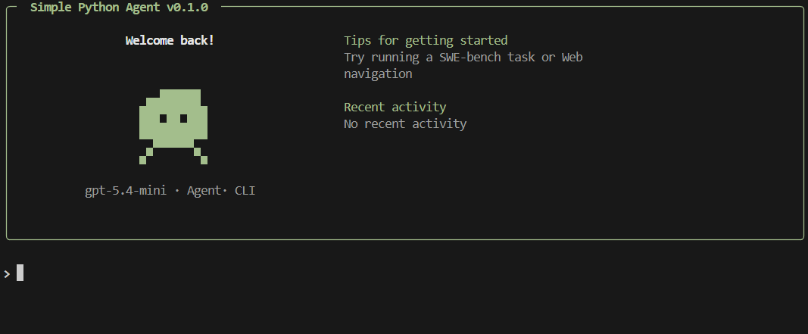

# Simple Python Agent



This is a minimal, framework-free Python agent built on top of the OpenAI API. It implements a skill routing mechanism, context sliding-window/compaction, and dynamic tool dispatch.

## Features
- **Skill Router**: Automatically routes user requests to the appropriate skill based on chat history and intent.
- **Autonomous Skill Creation**: Includes a native `skill-creator` allowing the agent to securely write, evaluate, and inject completely new skills and python tools into `self_authored` directories on the fly.
- **Prefrontal Cortex (PFC) Subagent**: Optional middleware that intercepts complex tasks and uses biological reasoning frameworks (WMM, IC, TI, MC) to de-chunk raw input and establish strict goal parameters before hitting the main reasoning loop.
- **Post-Action Reflection**: Skills can utilize a built-in `reflect` tool to evaluate tool outcomes directly against the active goal.
- **Context Compaction**: Uses a cheaper model to summarize older messages and maintain context without blowing up the token budget.
- **Skill System**: Defines skills simply via a `SKILL.md` file featuring YAML frontmatter for metadata (allowed tools, names, and subagent flags) and markdown for instructions.
- **Tool Dispatch**: Safely validates and executes python functions acting as tools.

## ⚠️ Security Warning

**This is a highly experimental, physical agent framework.**
Skills mapped to local executors (like `run_bash_command`) give the AI direct control over the host system. The framework uses a human-in-the-loop (HITL) prompt loop for shell executions by default, but it is highly recommended to run this framework inside a Docker container or VM during extended autonomous tests. Please read `SECURITY.md` for more information.

## Installation
1. Clone the repository.
2. Install dependencies:
   ```bash
   pip install -r requirements.txt
   ```
3. Copy `.env.example` to `.env` and add your OpenAI API key.

## Creating a Skill
Create a new folder in the `skills` directory and add a `SKILL.md` file using the following format. Add `requires-pfc: true` to route complicated reasoning requests through the subagent.

```markdown
---
name: swe-bench
description: Use when the user asks you to resolve software issues, navigate a codebase, fix bugs, or run tests. Perfect for evaluating autonomous programming capabilities.
allowed-tools: [view_file, edit_file, run_bash_command, reflect]
requires-pfc: true
---

Your job: You are an autonomous software engineering research agent...
```

## Running the Agent
Run the interactive CLI:
```bash
python cli.py
```
